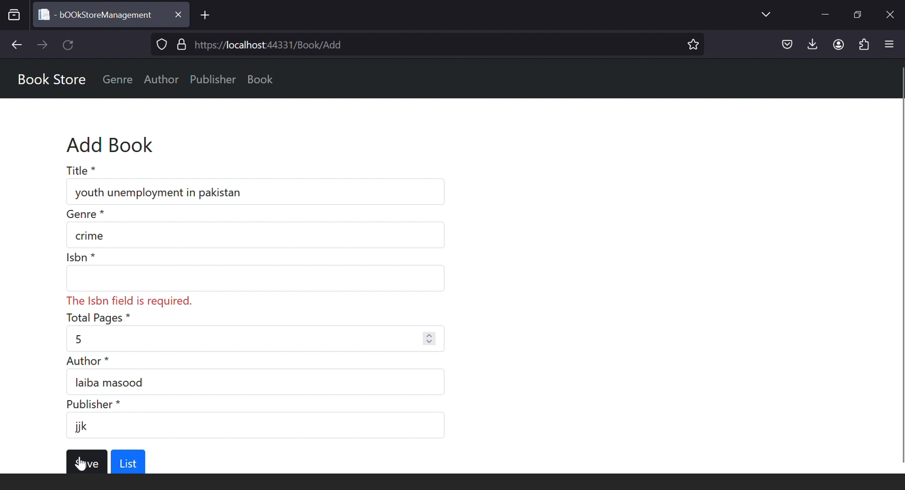
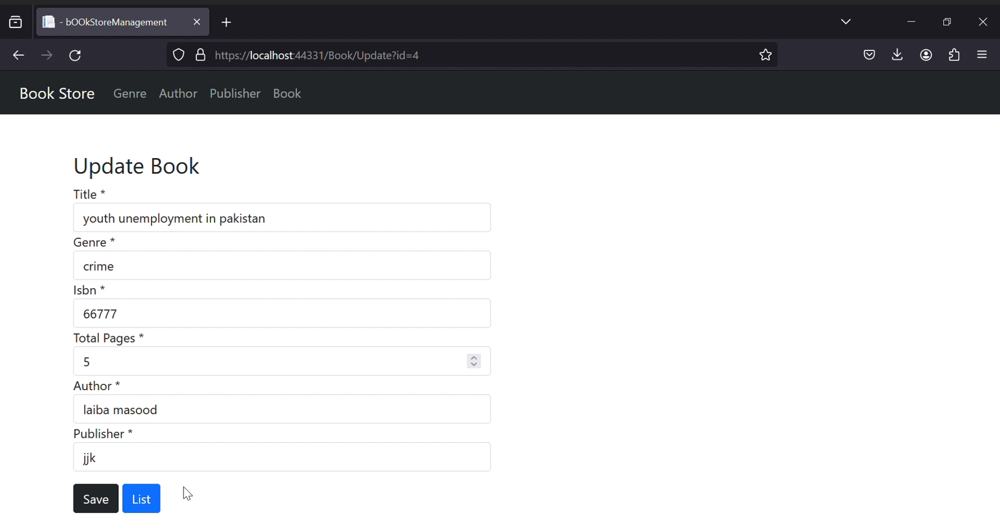
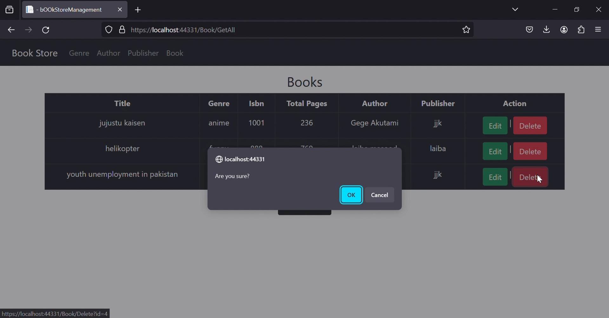
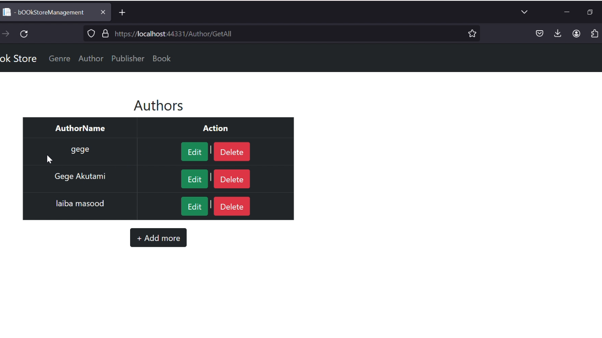
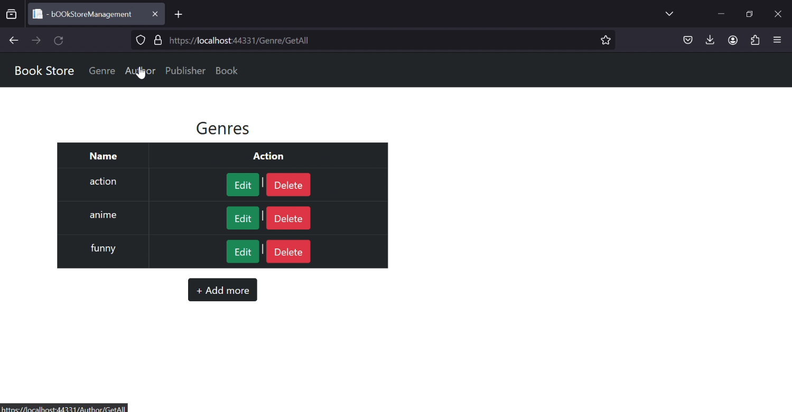
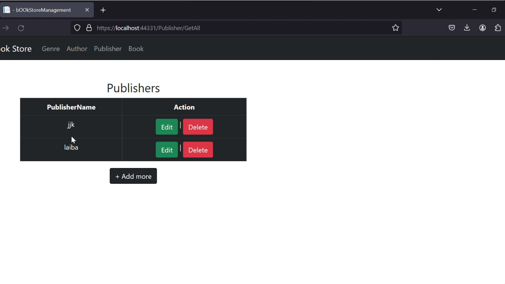
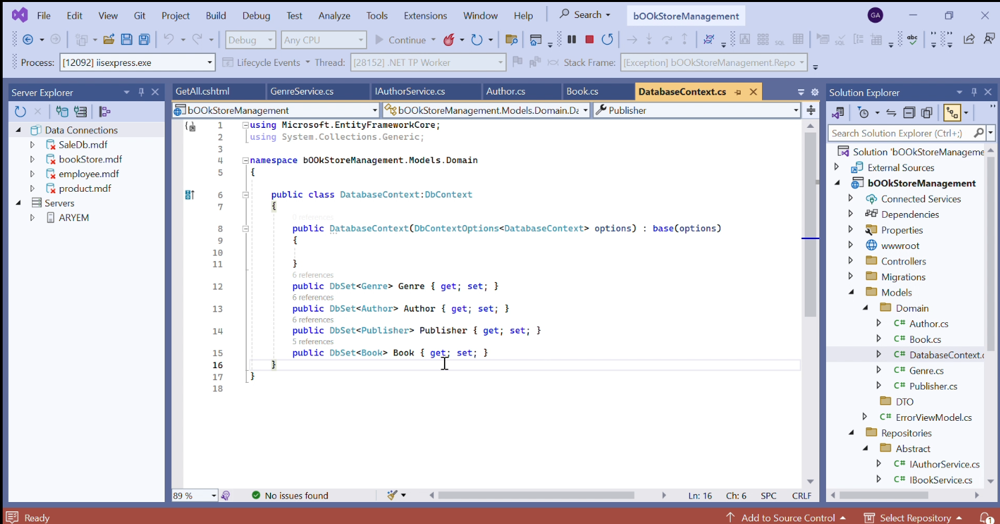

# 📚 BookStore Management App

This is a **.NET C# MVC** web application that enables administrators to manage a bookstore via **CRUD (Create, Read, Update, Delete)** functionality. It supports operations on **Books**, **Authors**, **Genres**, and **Publishers**.

---

## 🚀 Features

- 📘 Manage Books (Add, View, Update, Delete)
- ✍️ Manage Authors
- 📂 Manage Genres
- 🏢 Manage Publishers
- 🔍 Search & Filter across entities
- 🧪 Validations & Error Handling
- 📄 Clean MVC architecture

---

## 🏛️ Technologies Used

- **.NET Framework / .NET Core** with **ASP.NET MVC**
- **C#** for backend logic
- **Microsoft SQL Server** (or SQL Express) as the database
- **Entity Framework** (Code First or Database First)
- **Bootstrap / Razor Views** for frontend user interface

---

## 📷 Screenshots


### 🖥️ Dashboard / Main Listing Screen  


### ➕ Add New Book  


### 📚 View Books List  


### ✏️ Update Book  


### ❌ Delete Book  


### 🧑‍💼 Manage Authors  


### 📂 Manage Genres  


### 🏢 Manage Publishers  


### 🗃 DataBase Architecture  


---
## 📁 Project Structure

```
BookStore_Management/
├── Controllers/
│   ├── BooksController.cs
│   ├── AuthorsController.cs
│   ├── GenresController.cs
│   └── PublishersController.cs
├── Models/
│   ├── Book.cs
│   ├── Author.cs
│   ├── Genre.cs
│   └── Publisher.cs
├── Views/
│   ├── Books/
│   ├── Authors/
│   ├── Genres/
│   └── Publishers/
├── Data/
│   └── ApplicationDbContext.cs
├── appsettings.json
└── Startup.cs (or Global.asax if .NET Framework)
```

---

## 🛠️ How to Run the Project

1. Clone the repo:
    ```bash
    git clone https://github.com/Ghazal-Aryem/BookStore_Management.git
    ```
2. Open the solution in **Visual Studio** (2019 or later).
3. Configure the database connection string in `Web.config` (or `appsettings.json` if using .NET Core).
4. If using Entity Framework Code First, enable migrations and update the database:
    ```bash
    Update-Database
    ```
5. Build and run the application using IIS Express or your preferred local server.
6. Access the app in your browser at `https://localhost:xxxx`.

---

## 👤 Author

**Ghazal Aryem**  
[GitHub](https://github.com/Ghazal-Aryem) | [LinkedIn](https://www.linkedin.com/in/ghazal-aryem-203a03255)
